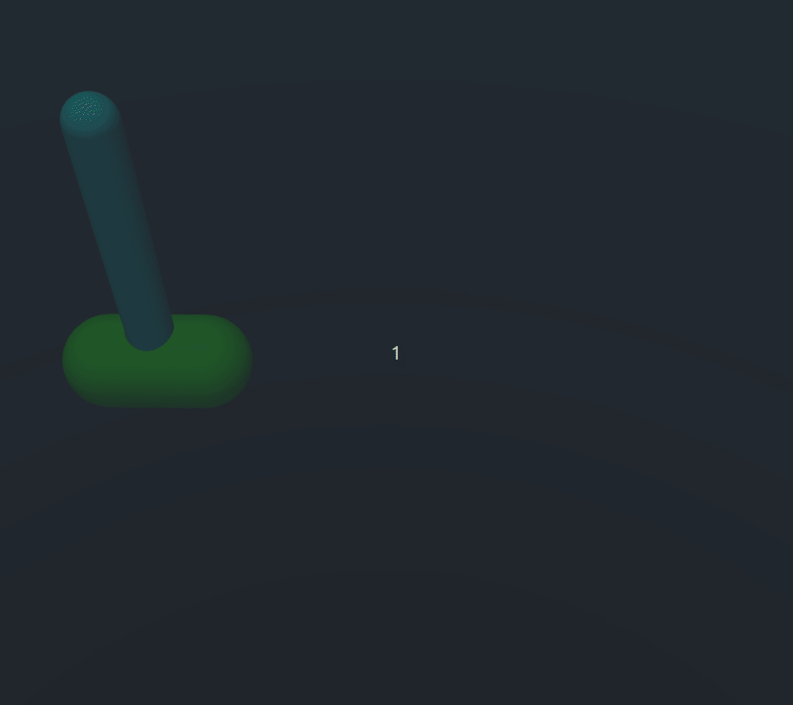
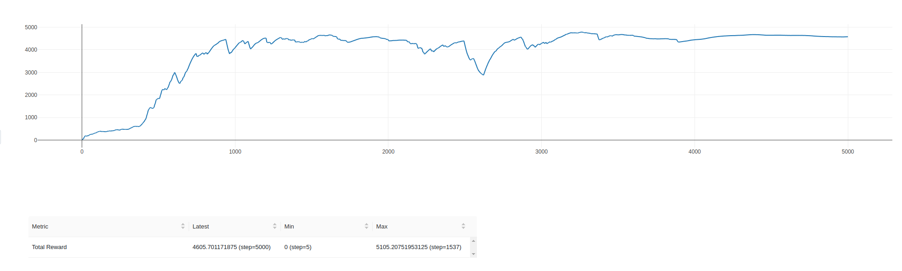

# PPO

Тестовое задание на позицию RL in Robotics:


Для воспроизведения симуляции итоговой политики на тесте:
> `(venv) python3 test.py`

### С помощью алгоритма Proximal Policy Optimization обучить политику, решающую две подзадачи

1. Подъем маятника из нижнего положения в верхнее с последующей стабилизацией 
2. Постановка конца маятника в соответствии с заданным положением в мировых координатах

Шаблон для решения: test.py

(использование данного шаблона обязательно)
Для решения второй подзадачи потребуется расширить вектор наблюдений и придумать формат эксперимента для агента

### Требования:
- ML библиотеки: только PyTorch
- Continuous action space
- Решение можно оформить как standalone репозиторий на github/gitlab. 
- Bonus points за читаемость
- Bonus points за стабилизацию маятника с произвольной массой
- Bonus points за текстовый отчет по проделанной работе и дизайну экспериментов


### Installation

Настройка виртуального окружения
```bash
virtualenv -p python3 venv
source venv/bin/activate
pip install -r requirements.txt
```

Контент файлов
```bash
- main.py # main-loop запуска обучения моделей
- test.py # inference на данном окружении
- my_env.py # данное окружение, расширенное базовыми атрибутами и функцией наград
- my_ppo.py # PPO policy stable-baseline, расширенная добавлением трекинга mlflow
- default_env.py # данное окружение
- snapshots 
  - baseline_model.zip # снепшот базовой модели п. 1
  - baseline_trans_model.zip # снепшот дообученной модели п. 2
  - bound_expand_model.zip # снепшот расширенной модели п. 3
```
### Ход решения

После анализа поставленных задач сформировалось понимание, что задача 2 является наиболее перспективной с точки зрения 
понимания хода решения и затраты времени, поэтому было решено начать с нее.  У меня была гипотеза, что задачу постановки 
конца маятника в конкретное положение можно свести к стандартной задаче hold для маятника, после чего добиться возможности 
перемещения тележки со стоячим маятником в соответсвии с положением цели. Иными словами - фиксируем маятник в верхем положении,
а потом достигаем целевого положения (шарика) с помощью перемещения телеги.

Таким образом, задачу получилось решить в 3 этапа:

1. Стабилизация маятника в вертикальном положении при начальном распределении положения угла маятника и тележки
   в границах [-0.01, 0.01] (т.н задача hold).
   Для решения этого пункта был проведен ряд экспериментов с базовой моделью PPO из модуля stable_baselines, начиная с размера итерации 
   32 и до 1024 шагов. В целом, цель стабилизировать маятник была достигнута, однако, тележка все время норовила уехать на
   край рабочей зоны.
   
   Для решения этой проблемы был проведен ряд экспериментов с reward-engineering, где был добавлен штраф в случае, 
   если тележка сильно отъезжала от нуля. Параметры наиболее удачного эксперимента приведены ниже, снепшот данной модели
   был взят за baseline для следующих шагов. Обучение проходило на данном окружении на 5000 итераций со следующими параметрами и функцией наград
   >    
        ("batch_size", 64),
        ("clip_range", 0.4),
        ("ent_coef", 1.37976e-07),
        ("gae_lambda", 0.9),
        ("gamma", 0.999),
        ("learning_rate", 0.000222425),
        ("max_grad_norm", 0.3),
        ("n_epochs", 5),
        ("n_steps", 1024),
        ("policy", "MlpPolicy"),
        ("vf_coef", 0.19816),
    
        #REWARD FUNCTION
        if np.abs(pole_angle) < np.pi / 8 and np.abs(pole_velocity) < 0.5:
            reward = 5 - np.abs(cart_position)
        else:
            reward = 0
#### График обучения baseline модели:


2. Далее, для более стабильного поведения маятника и телеги около нуля baseline модель была дообучена с улучшением функции наград,  
   так как в функции наград предыдущей модели мы давали одинаковую награду за любой угол в промежутке от `-pi/8` до `-pi/8`,
   поэтому гипотетически, если мы дифференциируем награды за угол в этом промежутке, то маятник будет быстрее и стабильнее достигать
   верхнего положениях. Гипотеза оправдалась, модель дообучалась при тех же параметрах, но уже на 600 итераций и измененной функцией наград
>```python
>#TRANSFER LEARNING REWARD
> if np.abs(pole_angle) < np.pi / 8 and np.abs(pole_velocity) < 0.5:
>      reward = 6 * (np.cos(pole_angle)) - 3 * np.abs(cart_position) + (cart_position) < 0.05) * 2
> else:
>      reward = 0
> ```

#### График обучения transfer модели:


#### Поведение дообученной модели на симуляции


3. Теперь, когда мы получили стабильное поведение системы, необходимо расширить границы перемещения телеги, в которых
   система также способна ставить и стабильно держать маятник в вертикальном положении. Для получения такой политики
   дообучим модель, полученную в п.2 при постепенном расширении границ начального распределения положения тележки по ходу итераций. 
   Обучение  на 3000 итераций, до 1600й итерации расширяем границы начального распределения телеги на значение 0.6 / 1600

#### График обучения bound extension модели:


#### Поведение полученной модели на тесте


#### Вопроизведение результатов
Для воспроизведения результатов обучения
1. Baseline
> `python3 main.py baseline`
2. Transfer learn
> `python3 main.py transfer`
3. Boundaries extension learn
> `python3 main.py bound_ext`


### Доработки и дальнейшие эксперименты

В качестве альтернативных решений для задачи постановки конца маятника в конкретную точку (догон красного шарика), можно рассмотреть следующие варианты:
Использование end-to-end RL политики (для этого в текущем сетапе можно расширить вектор наблюдений значением текущего расстояния от конца маятника до цели,
а также добавить в функцию наград терм, поощряющий за минимизацию этого расстояния)

Также хотелось бы описать несколько идей для решения задачи 1 (upswing). Возможно рассмотрение как минимум трех направлений решения этой задачи:
1. Дообучение уже полученных моделей со значительно большим количеством итераций и измененными функциями наград. Примеры:
   - Взять модель trans learn из данного репозитория, которая способна стабильно удерживать маятник в вертикальном положении, а телегу - в 0
   и изменить функцию наград, добавив больший коэффициент на достижение угла
   - Ввести дифференцированную функцию наград в зависимости от сектора пространтва, в котором находится маятник и активно поощрять за переходы из нижних секторов в верхние
2. Последовательное расширение границ начального распределения положения угла маятника (эксперимент, аналогичный проведенному в п.3)
3. Использование комбинации техник классического управления и RL (например, подъем маятника с помощью нелинейного MPC и 
стабилизация в верхнем положении с помощью RL, переключение между ними осуществлять по soft-switch в зависимости от текущего положения маятника)

