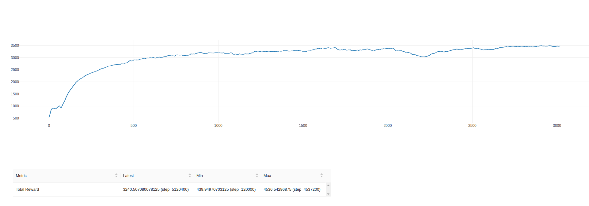
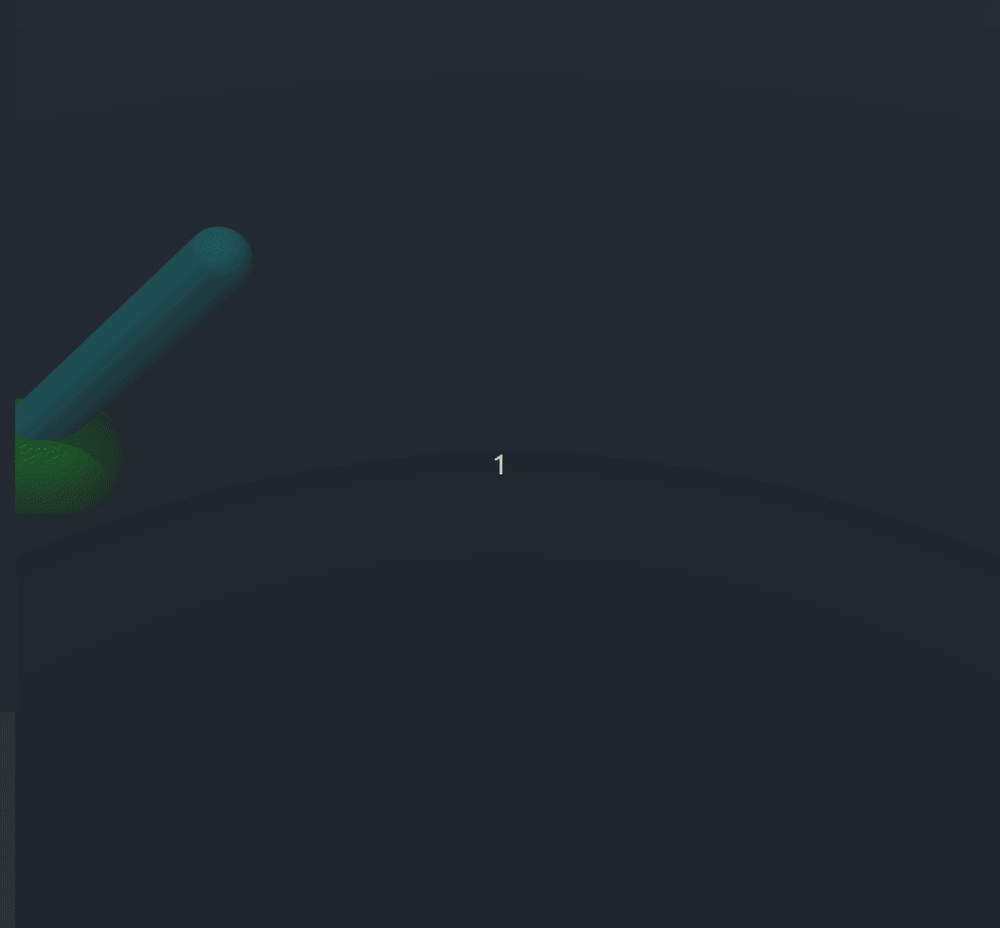

# PPO


Для воспроизведения симуляции итоговой политики на тесте:
> `(venv) python3 test.py`

### С помощью алгоритма Proximal Policy Optimization обучить политику, решающую две подзадачи

1. Подъем маятника из нижнего положения в верхнее с последующей стабилизацией 
2. Постановка конца маятника в соответствии с заданным положением в мировых координатах


### Installation

Настройка виртуального окружения
```bash
virtualenv -p python3 venv
source venv/bin/activate
pip install -r requirements.txt
```
Контент репозитория
```bash
- main
- my_ppo # собственное решение задачи
- from_baseline # первое решение данной задачи, основанное на готовой имплементации из stable baselines
```
Контент файлов (ветка main)
```bash
- main.py # main-loop запуска обучения моделей
- test.py # inference на данном окружении
- my_env.py # данное окружение, расширенное базовыми атрибутами и функцией наград
- ppo.py # самостоятельная имплементация PPO с добавлением mlflow
- networks.py # сетки Actor и Critic для PPO
- default_env.py # данное окружение
- snapshots 
  - ppo_actor_cartpole_hold.pth
  - ppo_critic_cartpole_hold.pth
  - ppo_actor_cartpole_upswing.pth
  - ppo_criric_cartpole_upswing.pth
```
### Ход решения

В первую очередь стояла задача самостоятельной имплементации PPO, после чего воспроизведение результатов первой итерации
решения (решение задачи hold). В результате обучения ряда экспериментов была получена политика, способная удерживать маятник 
вертикально при начальном положении телеги в 0 и маятника - вертикально соответственно. Данная политика была обучена при 
6000 итерациях и следующих параметрах:

```python
timesteps_per_batch = 1024
max_timesteps_per_episode = 400
gamma = 0.999
n_updates_per_iteration = 5
ppo_clip = 0.2 
lr = 0.000222425
ent_coef = 1.37976e-07 # Entropy regularization coefficient
grad_norm = 0.3
gae_lam = 0.9 # GAE Lambda


# REWARD FUNCTION
if np.cos(pole_angle) > 0:
            reward = np.cos(pole_angle) * 5 - np.abs(np.sin(pole_angle)) * 3 + (np.abs(cart_position) < 0.1) * 2
            if np.abs(pole_angle) < np.pi / 8 and np.abs(pole_velocity) < 0.5:
                reward += 6 * np.cos(pole_angle) - 3 * np.abs(cart_position) + (np.abs(cart_position) < 0.05) * 2
        else:
            reward = 0
```

#### График обучения hold модели:


#### Поведение hold модели на тесте


Теперь стоит задача обучить политику, способную не только держать маятник, но и запрокидывать его наверх. Для получения
такой политики были следующие гипотезы:
1. Дообучить модель на hold, изменив там начальное положение и функцию наград (конкретно ввести награду, зависящую от 
сектора пространства)

В результате проверки данной гипотезы была получена политика, которая вполне способна запрокидывать маятник наверх, но не
была способна его удерживать. В ходе экспериментов также возникала необходимость варьировать гиперпараметры,
поскольку по ходу обучения политика "застревала" в локальных минимумах.

2. Провести эксперимент по расширению границ изначального положения тележки и угла

Как и в первой версии решения со stable-baselines, данная гипотеза не оправдалась применительно к большому расширению 
границ угла.

3. Reward-engineering

Для решения проблемы удержания маятника после подъема возникла явная необходимость в смене функции наград, стало понятно,
что необходим учет всех компонент observation для расчета награды. Базой для данного реворда послужила награда, которую
ипользовали в подобной задаче, но решали другим алгоритмом. После ряда экспериментов удалось получить политику, которая
также способна запрокидывать маятник наверх, но не может его удерживать долго. Параметры наиболее удачного эксперимента
привежены ниже:
```python
timesteps_per_batch = 1024
max_timesteps_per_episode = 400
gamma = 0.99
n_updates_per_iteration = 5
clip = 0.2
lr = 0.00025
ent_coef = 1.37976e-07
grad_norm = 0.5
gae_lam = 0.9 # GAE Lambda

env.dt = 0.05

#REWARD FUNCTION
two_pi = 2 * np.pi
reward_theta = (np.e ** (np.cos(pole_angle) + 1.0) - 1.0)
reward_x = np.cos((cart_position / 5) * (np.pi / 2.0))
reward_theta_dot = (np.cos(pole_angle) * (np.e ** (np.cos(pole_an_speed) + 1.0) - 1.0) / two_pi) + 1.0
reward_x_dot = ((np.cos(pole_angle) * (np.e ** (np.cos(cart_speed) + 1.0) - 1) / two_pi) + 1.0)
reward = (reward_theta + reward_x + reward_theta_dot + reward_x_dot) / 4.0

if np.cos(pole_angle) > 0:
   reward += np.cos(pole_angle) * 5 - np.abs(np.sin(pole_angle)) * 3 + (np.abs(cart_position) < 0.1) * 2
   if np.abs(pole_angle) < np.pi / 8 and np.abs(pole_an_speed) < 0.5:
      reward += 6 * np.cos(pole_angle) - 3 * np.abs(cart_position) + (np.abs(cart_position) < 0.05) * 2
 ```

#### График обучения upswing модели:


#### Поведение upswing модели на симуляции


#### Итоговая политика

Таким образом, у нас оказалось 2 обученные политики - одна из них способна удерживать маятник в вертикальном положении,
но не способна поднимать, вторая же, напротив, - способна запрокидывать, но не может удержать. Естественным решением 
здесь будет являться объединение этих двух политик, что и было сделано. Переключение между политиками осуществляется
следующим образом (по сути была использована одна из предложенных гипотез):
```python
    if np.cos(pole_angle) > 0:
        action = np.cos(pole_angle) * action_hold + (1 - np.cos(pole_angle)) * action_swing_up
    else:
        action = action_swing_up
```


