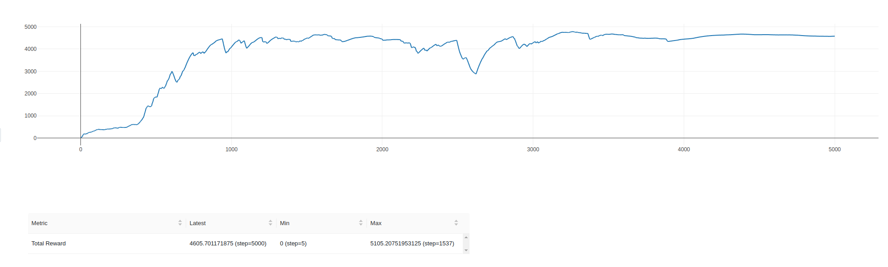
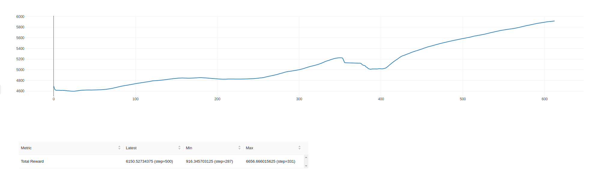
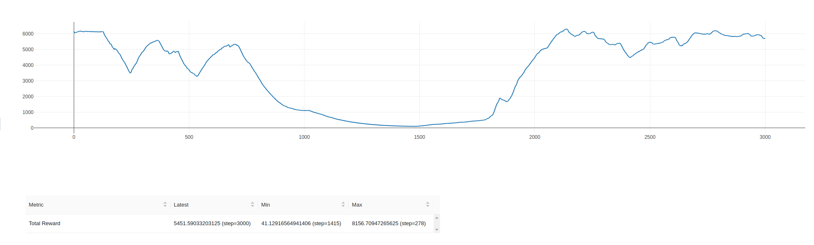

# PPO

Тестовое задание на позицию RL in Robotics:

### С помощью алгоритма Proximal Policy Optimization обучить политику, решающую две подзадачи

1. Подъем маятника из нижнего положения в верхнее с последующей стабилизацией 
2. Постановка конца маятника в соответствии с заданным положением в мировых координатах

Шаблон для решения: test.py

(использование данного шаблона обязательно)
Для решения второй подзадачи потребуется расширить вектор наблюдений и придумать формат эксперимента для агента

### Требования:
- ML библиотеки: только PyTorch
- Continuous action space
- Решение можно оформить как standalone репозиторий на github/gitlab. 
- Bonus points за читаемость
- Bonus points за стабилизацию маятника с произвольной массой
- Bonus points за текстовый отчет по проделанной работе и дизайну экспериментов


### Решение

Настройка виртуального окружения
```bash
virtualenv -p python3 venv
source venv/bin/activate
pip install -r requirements.txt
```

Для решения задачи постановка конца маятника в соответствии с заданным положением в мировых координатах (догона красного шарика) была использована следующая методология:
1. Стабилизация маятника в вертикальном положении при начальном распределении положения в границах [-0.01, 0.01] (т.н задача hold)
   2. В качестве baseline была обучена базовая модель PPO из модуля stable_baselines на данном окружении на 5000 итераций со следующими параметрами и функцией наград
   >    
        ("batch_size", 64),
        ("clip_range", 0.4),
        ("ent_coef", 1.37976e-07),
        ("gae_lambda", 0.9),
        ("gamma", 0.999),
        ("learning_rate", 0.000222425),
        ("max_grad_norm", 0.3),
        ("n_epochs", 5),
        ("n_steps", 1024),
        ("policy", "MlpPolicy"),
        ("vf_coef", 0.19816),
    
        #REWARD FUNCTION
        if np.abs(pole_angle) < np.pi / 8 and np.abs(pole_velocity) < 0.5:
            reward = 5 - np.abs(cart_position)
        else:
            reward = 0
#### График обучения baseline модели:


Далее, для более стабильного поведения маятника и телеги около нуля baseline модель была дообучена при тех же параметрах, но уже на 600 итераций и измененной функцией наград
> `#TRANSFER LEARNING REWARD
> if np.abs(pole_angle) < np.pi / 8 and np.abs(pole_velocity) < 0.5:
            reward = 6 * (np.cos(pole_angle)) - 3 * np.abs(cart_position) + (cart_position) < 0.05) * 2
        else:
            reward = 0
> `
#### График обучения transfer модели:

2. Обучение политики стабилизации маятника в вертикальном положении при постепенном расширении границ начального распределения положения тележки
Дообучаем теперь полученную на предыдущем шаге модель на 3000 итераций, до 1600й итерации расширяя границы начального распределения телеги на значение 0.6 / 1600
#### График обучения bound extension модели:


3. Инференс на тестовом окружении

Для воспроизведения симуляции итоговой политики на тесте:
> `python3 test.py`

#### Вопроизведение результатов
Для воспроизведения результатов обучения
1. Baseline
> `python3 main.py --baseline`
2. Transfer learn
> `python3 test.py --transfer`
3. Boundaries extension learn
> `python3 test.py --bound_ext`


### Доработки и дальнейшие эксперименты

В данном репозитории не была решена задача подъема маятника из крайнего нижнего положения и последующей его стабилизации 
(задача upswing). Возможно рассмотрение как минимум трех направлений решения этой задачи:
1. Дообучение уже полученных моделей со значительно большим количеством итераций и измененными функциями наград 
(например, взять модель trans learn из данного репозитория, которая способна стабильно удерживать маятник в вертикальном положении, а телегу - в 0
и изменить функцию наград, добавив больший коэффициент на достижение угла)
2. Последовательное расширение границ начального распределения положения угла маятника (эксперимент, аналогичный проведенному в п.3)
3. Использование комбинации техник классического управления и RL (например, подъем маятника с помощью нелинейного MPC и 
стабилизация в верхнем положении с помощью RL, переключение между ними осуществлять по soft-switch в зависимости от текущего положения маятника)


В качестве альтернативных решений для задачи постановки конца маятника в конкретную точку (догон красного шарика), можно рассмотреть следующие варианты:
Использование end-to-end RL политики (для этого в текущем сетапе можно расширить вектор наблюдений значением текущего расстояния от конца маятника до цели,
а также добавить в функцию наград терм, поощряющий за минимизацию этого расстояния)