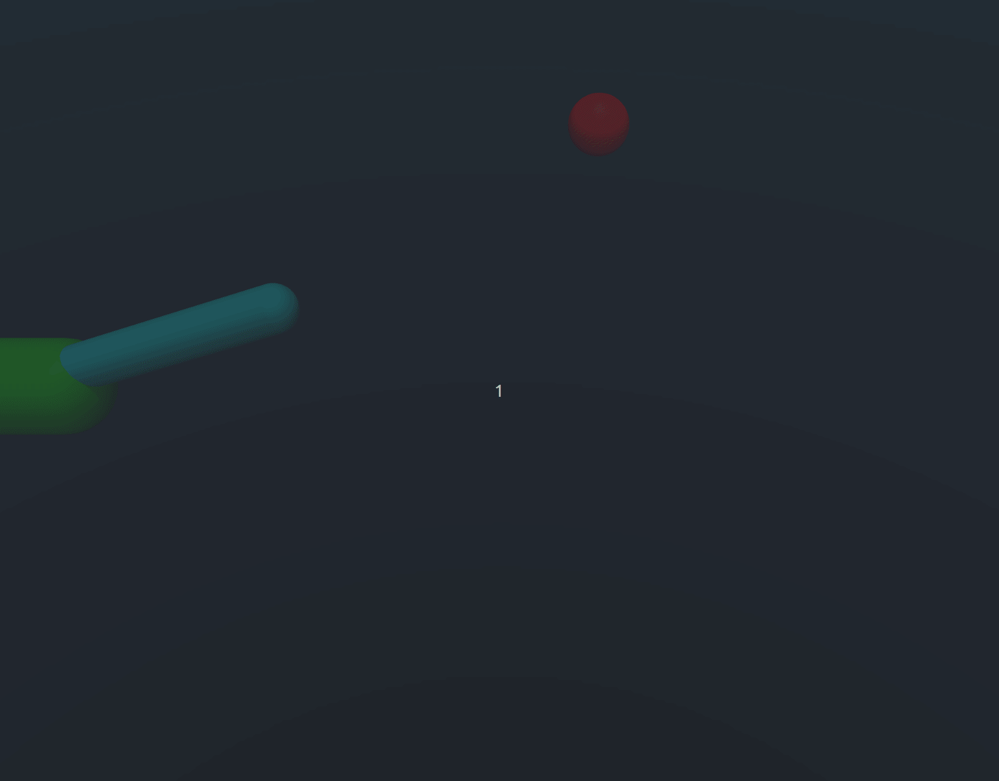

# PPO


### С помощью алгоритма Proximal Policy Optimization обучить политику, решающую две подзадачи

1. Подъем маятника из нижнего положения в верхнее с последующей стабилизацией 
2. Постановка конца маятника в соответствии с заданным положением в мировых координатах


### Данный репозиторий содержит 3 решения данной задачи

### Installation

Настройка виртуального окружения
```bash
virtualenv -p python3 venv
source venv/bin/activate
pip install -r requirements.txt
```
Контент репозитория
```bash
- main
- my_ppo # собственное решение задачи
- from_baseline # первое решение данной задачи, основанное на готовой имплементации из stable baselines
- extended_env # решение с расширенным вектором наблюдений
```
Контент файлов (ветка main)
```bash
- test.py # inference на данном окружении
- envs
  - default_env # данное исходное окружение
  - my_env.py # данное окружение, расширенное базовыми атрибутами и функцией наград
  - extended_env.py # окружение с расширенным вектором наблюдений
- ppo
  - baseline_ppo.py # PPO policy stable-baseline, расширенная добавлением трекинга mlflow
  - my_ppo.py # самостоятельно написанная версия
  - networks.py # сетки Actor and Critic для my_ppo
- snapshots 
  - ppo_actor_cartpole_hold.pth
  - ppo_critic_cartpole_hold.pth
  - ppo_actor_cartpole_upswing.pth
  - ppo_criric_cartpole_upswing.pth
  - ppo_actor_cartpole_extended.pth
  - ppo_criric_cartpole_extended.pth
  - bound_expand_model.zip
```

**1. Решение на основе PPO из stable_baselines**

Подробнее: ветка `from_baseline`


```bash
(venv) python3 test.py baseline
```

Плюсы:
- Хорошее, стабильное поведение на тесте

Минусы:
- Не решает задачу upswing
- Не учитывает положение шарика при обучении и тесте

**2. Решение на основе самостоятельно имплементированного PPO**

Подробнее: ветка `my_ppo`


```bash
(venv) python3 test.py basic
```

Плюсы:
- Решает задачу upswing
- Самодельный))))

Минусы:
- Не учитывает положение шарика при обучении
- Требует тюнинга (не очень высокая стабильность)

**3. Решение с расширенным вектором наблюдений**

Подробнее: ветка `extended_obs`



```bash
(venv) python3 test.py extended_obs
```

Плюсы:
- end-to-end политика, решающая все подзадачи

Минусы:
- требует донастройки и/или рефакторинга, низкая стабильность


