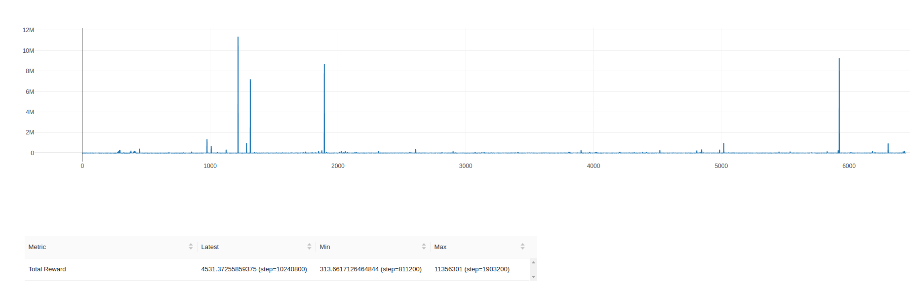

# PPO


Для воспроизведения симуляции итоговой политики на тесте:
> `(venv) python3 test.py`

### С помощью алгоритма Proximal Policy Optimization обучить политику, решающую две подзадачи

1. Подъем маятника из нижнего положения в верхнее с последующей стабилизацией 
2. Постановка конца маятника в соответствии с заданным положением в мировых координатах


### Installation

Настройка виртуального окружения
```bash
virtualenv -p python3 venv
source venv/bin/activate
pip install -r requirements.txt
```
Контент репозитория
```bash
- main
- my_ppo # собственное решение задачи
- from_baseline # первое решение данной задачи, основанное на готовой имплементации из stable baselines
- extended_obs # второе решение задачи с расширенным вектором наблюдений
```
Контент файлов (ветка `extended_obs`)
```bash
- main.py # main-loop запуска обучения моделей
- test_extended.py # inference на данном окружении
- extended_env.py # окружение с расширенным вектором наблюдений и переопределенной функцией наград
- ppo.py # самостоятельная имплементация PPO с добавлением mlflow
- networks.py # сетки Actor и Critic для PPO
- snapshots 
  - ppo_actor_cartpole_hold.pth
  - ppo_critic_cartpole_hold.pth
  - ppo_actor_cartpole_upswing.pth
  - ppo_criric_cartpole_upswing.pth
```
### Ход решения

После получения устойчивой политики для поднятия и удержания маятника без учета положений цели был проведен ряд экспериментов с 
целью сделать end-to-end политику с учетом положения шарика. Для этого пространство наблюдений было расширено на одно
измерение (положение шарика) и теперь структура выглядит следующим образом:
`obs = [cart_position, pole_angle, cart_velocity, pole_velocity, target_position]`.

С учетом нового наблюдения была также переопределена функция наград, был добавлен штраф в случае, если телега находится
далеко от цели и награда, если конец маятника приближается близко к цели

```python
#REWARD FUNCTION
two_pi = 2 * np.pi
reward_theta = (np.e ** (np.cos(pole_angle) + 1.0) - 1.0)
reward_x = np.cos((cart_position / 5) * (np.pi / 2.0)) - 2 * np.abs(target_position - cart_position)
reward_theta_dot = (np.cos(pole_angle) * (np.e ** (np.cos(pole_an_speed) + 1.0) - 1.0) / two_pi) + 1.0
reward_x_dot = ((np.cos(pole_angle) * (np.e ** (np.cos(cart_speed) + 1.0) - 1) / two_pi) + 1.0)
reward = (reward_theta + reward_x + reward_theta_dot + reward_x_dot) / 4.0

if np.cos(pole_angle) > 0:
    ball_pos = np.array([target_pos[0], target_pos[2]])
    pend_pos = np.array([0.6 * np.cos(pole_angle), 0.6 * np.sin(pole_angle)])
    dist = np.linalg.norm(ball_pos - pend_pos)
    reward += np.cos(pole_angle) * 5 - np.abs(np.sin(pole_angle)) * 3 + (target_position - cart_position) < 0.1) * 2 + (1 / dist)
    if np.abs(pole_angle) < np.pi / 8 and np.abs(pole_an_speed) < 0.5:
       reward += 6 * np.cos(pole_angle) (np.abs(target_pos[0] - ob[0]) < 0.05) * 3 + 3 * (1 / dist)
```

### Дизайн экспериментов

Изначально для проведения обучения был поставлен эксперимент, аналогичный тестовому окружению, когда положение шарика 
менялось каждые 5-30 шагов. Такие эксперименты не позволяли получить устойчивые политики, поскольку агент просто не 
успевал обучаться под положение цели. На тесте подобные политики вели себя следующим образом:


Дальнейшние эксперименты проводились уже по-другому: теперь положение цели обновляется каждый батч, однако, такие политики
хотя и выглядели более осмысленно, но были крайне неустойчивы и имели проблемы с gradient exploding:

**График обучения модели**


**Поведение модели на тесте**


Для решения проблемы взрыва наград и градиентов была отредактирована функция наград:
```python
if np.cos(pole_angle) > 0:
    ball_pos = np.array([target_pos[0], target_pos[2]])
    pend_pos = np.array([0.6 * np.cos(pole_angle), 0.6 * np.sin(pole_angle)])
    dist = np.linalg.norm(ball_pos - pend_pos)
    reward += np.cos(pole_angle) * 5 - np.abs(np.sin(pole_angle)) * 3 + (target_position - cart_position) < 0.1) * 2 + min(10, 1 / dist)
    if np.abs(pole_angle) < np.pi / 8 and np.abs(pole_an_speed) < 0.5:
       reward += 6 * np.cos(pole_angle) (np.abs(target_pos[0] - ob[0]) < 0.05) * 3 + min(20, 1 / dist)
```
Теперь график обучения выглядит более плавным


Поведение политики на тесте также улучшилось, хотя и не стало значительно более стабильным


### TODO и идеи для дальнейших экспериментов

1. Внедрить Value Clipping и Reward Scaling
2. Изменить схему обучения модели: вместо end-to-end обучения, где сразу учитывается положение шарика в функции наград,
сначала обучить модель, решающую upswing и hold в конкретной точке (например, в 0), после чего дообучить
модель на функции наград, учитывающей только положение тележки и шарика (другими словами, сначала ставим маятник - потом
ведем его к цели)

