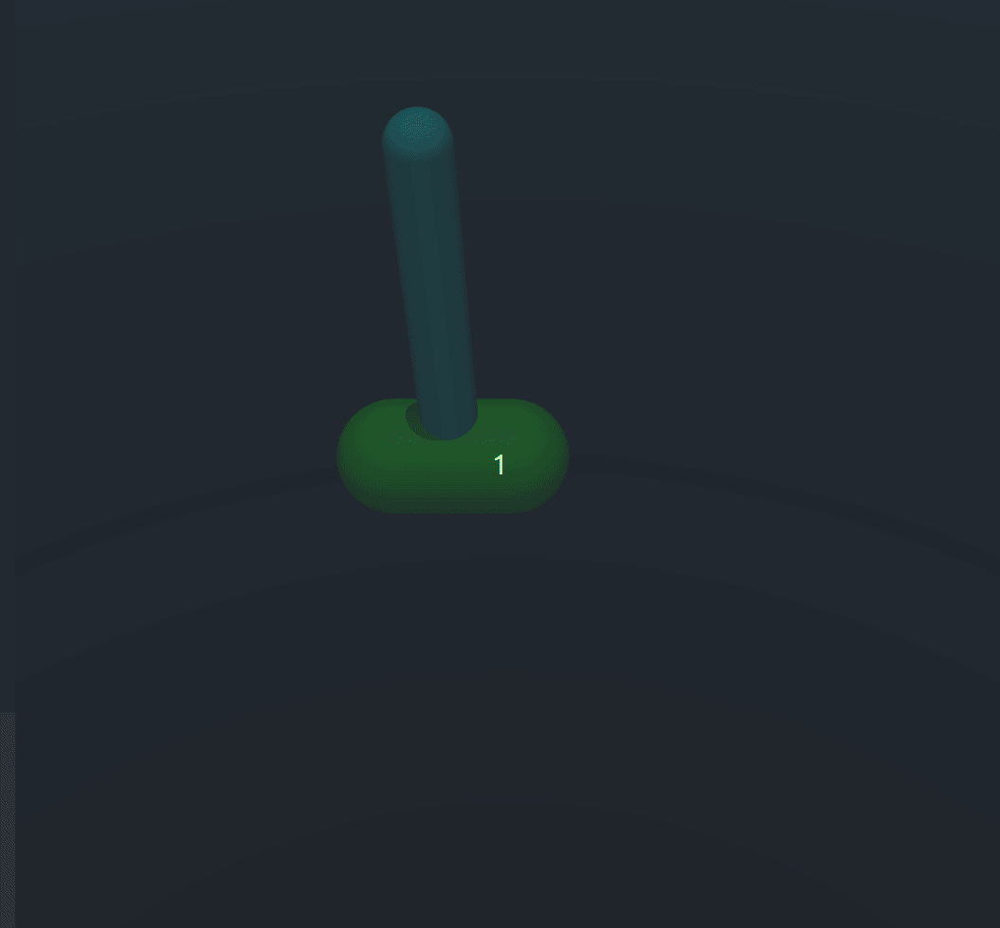

# PPO

Тестовое задание на позицию RL in Robotics:


Для воспроизведения симуляции итоговой политики на тесте:
> `(venv) python3 test.py`

### С помощью алгоритма Proximal Policy Optimization обучить политику, решающую две подзадачи

1. Подъем маятника из нижнего положения в верхнее с последующей стабилизацией 
2. Постановка конца маятника в соответствии с заданным положением в мировых координатах

Шаблон для решения: test.py

(использование данного шаблона обязательно)
Для решения второй подзадачи потребуется расширить вектор наблюдений и придумать формат эксперимента для агента

### Требования:
- ML библиотеки: только PyTorch
- Continuous action space
- Решение можно оформить как standalone репозиторий на github/gitlab. 
- Bonus points за читаемость
- Bonus points за стабилизацию маятника с произвольной массой
- Bonus points за текстовый отчет по проделанной работе и дизайну экспериментов


### Installation

Настройка виртуального окружения
```bash
virtualenv -p python3 venv
source venv/bin/activate
pip install -r requirements.txt
```
Контент репозитория
```bash
- main
- my_ppo # собственное решение задачи
- from_baseline # первое решение данной задачи, основанное на готовой имплементации из stable baselines
```
Контент файлов (ветка main)
```bash
- main.py # main-loop запуска обучения моделей
- test.py # inference на данном окружении
- my_env.py # данное окружение, расширенное базовыми атрибутами и функцией наград
- ppo.py # самостоятельная имплементация PPO с добавлением mlflow
- networks.py # сетки Actor и Critic для PPO
- default_env.py # данное окружение
- snapshots 
  - ppo_actor_cartpole_hold.pth
  - ppo_critic_cartpole_hold.pth
  - ppo_actor_cartpole_upswing.pth
  - ppo_criric_cartpole_upswing.pth
```
### Ход решения

В первую очередь стояла задача самостоятельной имплементации PPO, после чего воспроизведение результатов первой итерации
решения (решение задачи hold). В результате обучения ряда экспериментов была получена политика, способная удерживать маятник 
вертикально при начальном положении телеги в 0 и маятника - вертикально соответственно. Данная политика была обучена при 
3000 итерациях и следующих параметрах:

```python
timesteps_per_batch = 1024
max_timesteps_per_episode = 400
gamma = 0.999
n_updates_per_iteration = 5
ppo_clip = 0.2 
lr = 0.000222425
ent_coef = 1.37976e-07 # Entropy regularization coefficient
grad_norm = 0.3
gae_lam = 0.9 # GAE Lambda

env_dt = 0.05 # дефолтное значение данного параметра - 0.02, что показало худшие результаты в сравнении с 0.05

# REWARD FUNCTION
if np.cos(pole_angle) > 0:
            reward = np.cos(pole_angle) * 5 - np.abs(np.sin(pole_angle)) * 3 + (np.abs(cart_position) < 0.1) * 2
            if np.abs(pole_angle) < np.pi / 8 and np.abs(pole_velocity) < 0.5:
                reward += 6 * np.cos(pole_angle) - 3 * np.abs(cart_position) + (np.abs(cart_position) < 0.05) * 2
        else:
            reward = 0
```

#### График обучения hold модели:


#### Поведение hold модели на тесте


Теперь стоит задача обучить политику, способную не только держать маятник, но и запрокидывать его наверх. Для получения
такой политики были следующие гипотезы:
1. Дообучить модель на hold, изменив там начальное положение и функцию наград (конкретно ввести награду, зависящую от 
сектора пространства)

В результате проверки данной гипотезы была получена политика, которая вполне способна запрокидывать маятник наверх, но не
была способна его удерживать. В ходе экспериментов также возникала необходимость варьировать гиперпараметры,
поскольку по ходу обучения политика "застревала" в локальных минимумах.

2. Провести эксперимент по расширению границ изначального положения тележки и угла

Как и в первой версии решения со stable-baselines, данная гипотеза не оправдалась применительно к большому расширению 
границ угла.

3. Reward-engineering

Для решения проблемы удержания маятника после подъема возникла явная необходимость в смене функции наград, стало понятно,
что необходим учет всех компонент observation для расчета награды. Базой для данного реворда послужила награда, которую
ипользовали в подобной задаче, но решали другим алгоритмом. После ряда экспериментов удалось получить политику, которая
также способна запрокидывать маятник наверх, но не может его удерживать долго. Параметры наиболее удачного эксперимента
привежены ниже:
>```python
>#TRANSFER LEARNING REWARD
> if np.abs(pole_angle) < np.pi / 8 and np.abs(pole_velocity) < 0.5:
>      reward = 6 * (np.cos(pole_angle)) - 3 * np.abs(cart_position) + (cart_position) < 0.05) * 2
> else:
>      reward = 0
> ```

#### График обучения upswing модели:


#### Поведение upswing модели на симуляции


Таким образом, у нас оказалось 2 обученные политики - одна из них способна удерживать маятник в вертикальном положении,
но не способна поднимать, вторая же, напротив, - способна запрокидывать, но не может удержать. 

#### График обучения bound extension модели:


#### Поведение полученной модели на тесте


#### Вопроизведение результатов
Для воспроизведения результатов обучения
1. Baseline
> `python3 main.py baseline`
2. Transfer learn
> `python3 main.py transfer`
3. Boundaries extension learn
> `python3 main.py bound_ext`


### Доработки и дальнейшие эксперименты

В качестве альтернативных решений для задачи постановки конца маятника в конкретную точку (догон красного шарика), можно рассмотреть следующие варианты:
Использование end-to-end RL политики (для этого в текущем сетапе можно расширить вектор наблюдений значением текущего расстояния от конца маятника до цели,
а также добавить в функцию наград терм, поощряющий за минимизацию этого расстояния)

Также хотелось бы описать несколько идей для решения задачи 1 (upswing). Возможно рассмотрение как минимум трех направлений решения этой задачи:
1. Дообучение уже полученных моделей со значительно большим количеством итераций и измененными функциями наград. Примеры:
   - Взять модель trans learn из данного репозитория, которая способна стабильно удерживать маятник в вертикальном положении, а телегу - в 0
   и изменить функцию наград, добавив больший коэффициент на достижение угла
   - Ввести дифференцированную функцию наград в зависимости от сектора пространтва, в котором находится маятник и активно поощрять за переходы из нижних секторов в верхние
2. Последовательное расширение границ начального распределения положения угла маятника (эксперимент, аналогичный проведенному в п.3)
3. Использование комбинации техник классического управления и RL (например, подъем маятника с помощью нелинейного MPC и 
стабилизация в верхнем положении с помощью RL, переключение между ними осуществлять по soft-switch в зависимости от текущего положения маятника)

